# Hi, I'm Alexis Carpentier 👋
 
**Full Stack Developer · 42 Paris · Integrating AI into modern apps**
 
I'm a software engineering student at 42 Paris, building full stack projects that combine clean architecture with practical AI integration. I work across the whole stack — from low-level C systems to modern TypeScript web apps.
 
---
 
## 🛠 Tech Stack
 
**Languages**

 
**Frameworks & Tools**

 
---
 
## 🚀 Featured Projects
 
### [ft_transcendence](https://github.com/Hushhhy/ft_transcendence)
> Full stack web app — real-time multiplayer Blackjack with authentication, stats, and user management.  
> **Stack:** TypeScript · Node.js · WebSockets · PostgreSQL · Docker
 
### [Minishell](https://github.com/Hushhhy/minishell)
> A fully functional Unix shell built from scratch in C — parsing, redirections, pipes, builtins.  
> **Stack:** C · POSIX
 
---
 
## 📌 Currently
 
- 🎓 Finished the **42 Paris Common Core**
- 🔨 Building a **personal portfolio** (coming soon)
- 🤖 Working on a **42 specialisation project** with AI integration
- 📫 Reach me on [LinkedIn](https://www.linkedin.com/in/alexis-carpentier-37b8a6189/)
---
 

  

